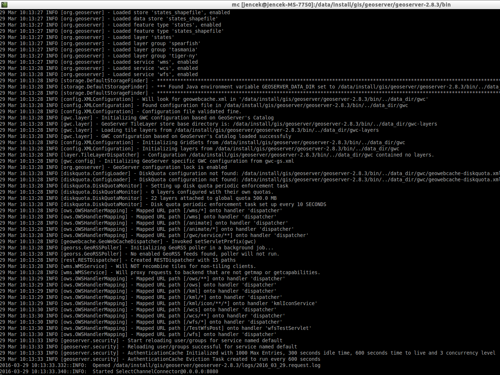
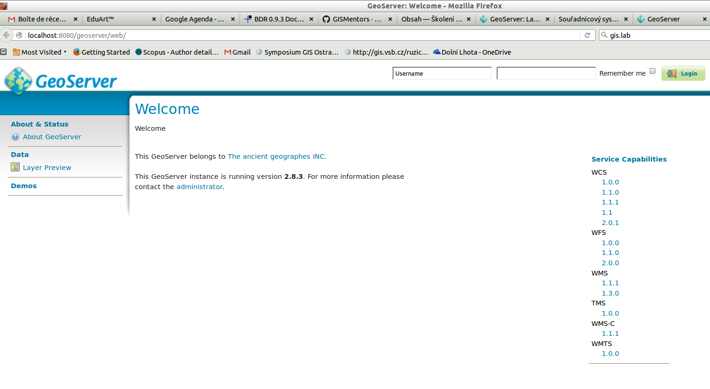
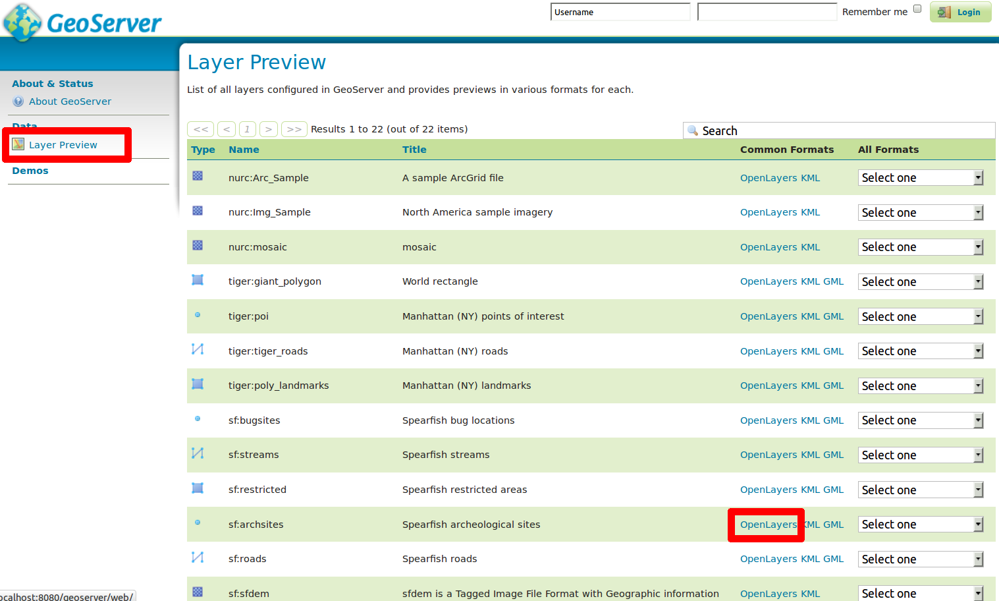
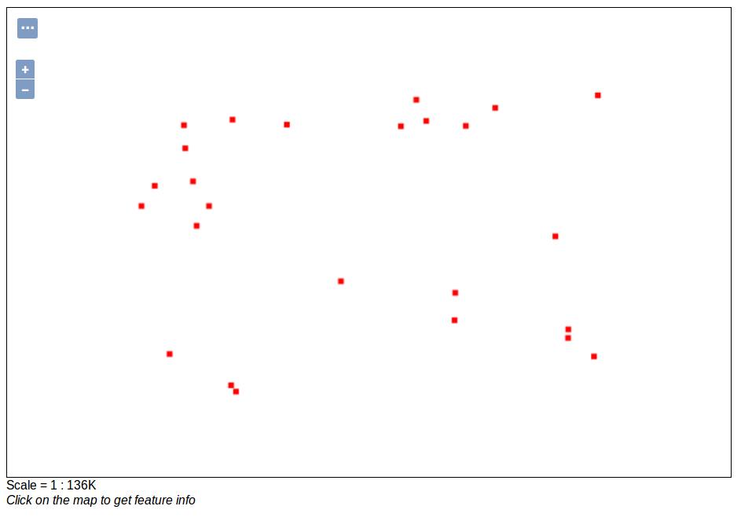

Úvod do systému GeoServer
-------------------------

Po úspěšné instalaci systému GeoServer (dle návodu pro :doc:`GNU/Linux
<../instalace/linux>` nebo :doc:`MS Windows <../instalace/windows>`)
je možné jej spustit a začít okamžitě pracovat.

.. index::
   single: spuštění GeoServer

Spuštění systému GeoServer
==========================

Úspěšně nainstalovaný systém by měl být spustitelný z příkazové řádky 
pomocí příkazu bash startup.sh (pro Linux)
nebo spuštěním dávkového souboru startup.bat (pro Windows).
V obou případech čekáme až server naběhne zcela.

.. notecmd:: Spuštění GeoServer
             
   .. code-block:: bash
		
      bash startup.sh

.. raw:: latex

	 \newpage

   Spuštění systému GeoServer v Ubuntu.

Server je spuštěn v okamžiku, kdy se objeví informační hláška:
`INFO:  Started SelectChannelConnector@0.0.0.0:8080`

Možné problémy a jejich řešení
==============================

Obvyklým problémem je nespuštění serveru s chybovou hláškou
Address already in use. To znamená, že na portu `8080`, kde
se server startuje, již něco běží.

V takovém případě je nutné změnit port pro start serveru.
Toto se dělá v souboru `etc/jetty.xml` nahrazením portu `8080`
jiným číslem např. `25000`. U portu s čísly většími než `20000`
se dá očekávat, že jsou volné.

.. note:: V případě, že toto nepomůže je problém složitější a je nutné kontaktovat lektora.

Ověření běhu
============

Informační hláška INFO:  Started SelectChannelConnector@0.0.0.0:8080
bohužel nemusí znamenat, že server běží. Toto je nutné ověřit.
Ověření se dělá přes WWW prohlížeč zadáním adresy:
http://localhost:8080/geoserver/

.. note:: V případě, že jste změnili port, je nutné i zde zadat jiné číslo portu než 8080.

.. raw:: latex

	 \newpage

   Ověření spuštění systému GeoServer.

V případě, že se objeví uvítací obrazovka je systém pravděpodobně spuštěn.
Přesto je vhodné provést ještě jedno ověření. Ověření se realizuje výběrem Layer Preview
a výběrem možnosti Open Layers u vrstvy `sf:archsites`. Pokud se objeví mapa bodové vrstvy, je
systém spuštěn.

.. raw:: latex

	 \newpage

   Ověření spuštění systému GeoServer pomocí vizualizace vrstvy geodat.
   
.. raw:: latex

	 \newpage

   Vrstva sf:archsites.

.. note:: Toto ověření je vhodné realizovat vždy po restartu serveru.
