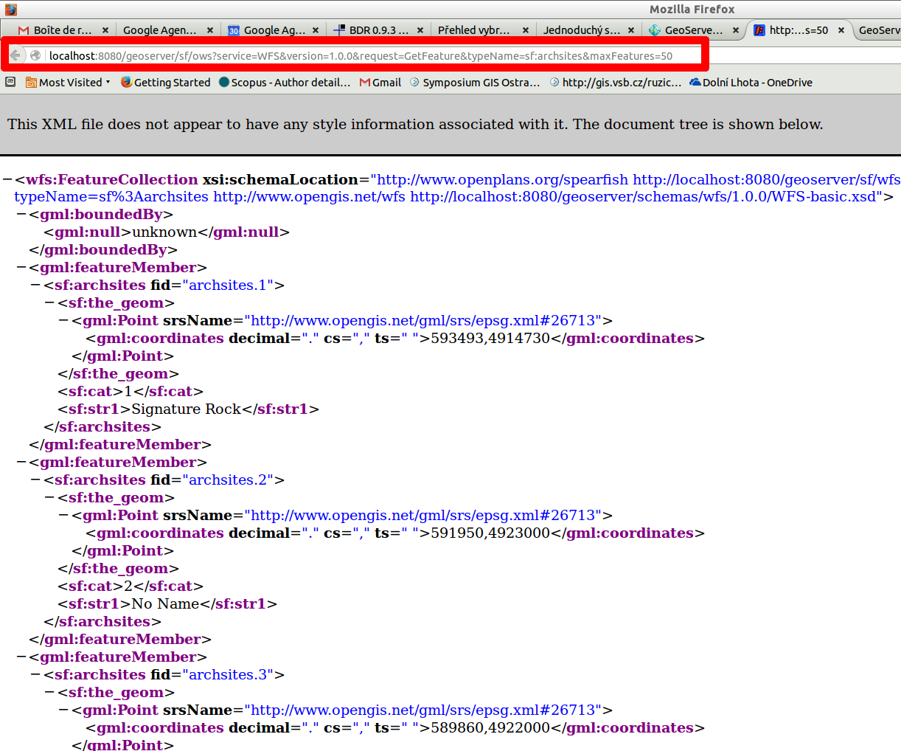
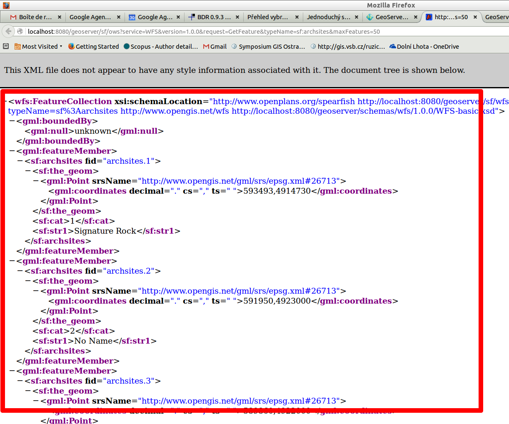

.. index::
   single: Web Feature Service

.. _wfs:

Web Feature Service
-------------------

Druhý základní protokol, který GeoServer podporuje je
Web Feature Service (WFS). WFS umožňuje klientovi ze
serveru získat geodata v podobě vektoru s atributy. Obvykle se jedná
o kolekci kódovanou v jazyce GML (Geography Markup Language), ale není to podmínkou.
Data mohou být vrácena např. ve formátu ESRI Shapefile.
   
Základní dotaz WFS
==================

Základní dotaz WFS je možné zaslat přes Layer Preview a
vyberat možnost GML pro vrstvu sf:archsites. 

Kompletní dotaz zaslaný na stranu serveru najdete v řádku URL (WWW) adresy.

   Umístění WFS dotazu v prohlížeči.

Danou adresu je možné rozebrat na jednotlivé části, kde oddělovačem je ? a &

.. code-block:: sql

	http://localhost:8080/geoserver/sf/ows?
	service=WFS&
	version=1.0.0&
	request=GetFeature&
	typeName=sf:archsites&
	maxFeatures=50

První část před otazníkem je virtuální soubor, kam je dotaz zasílán. Dispečer
serveru zašle požadavek na příslušný servlet. 

Další části jsou parametry, které určují jak bude výstup vypadat.

Service
^^^^^^^
Parametr udává název služby (protokolu), která má být využita.

Version
^^^^^^^
Parametr udává verzi služby (protokolu), která má být využita.

Request
^^^^^^^
Typ požadavku, který má být obsloužen. V případě WFS je možných několik hodnot, jako
hlavní lze uvést GetCapabilities, GetFeature a DescribeFeatureType.

TypeName
^^^^^^^^
Název vrstvy, která má být dotazována.

MaxFeatures
^^^^^^^^^^^
Maximální počet objektů v získané kolekci.

Základní odpověď WFS
====================

Obvyklou odpovědí je kolekce geoprvků. Jejich popis je kódován pomocí jazyka GML.

   Obvyklá odpověď WFS služby.
   
.. code-block:: xml

	<?xml version="1.0" encoding="UTF-8"?>
	<wfs:FeatureCollection xmlns="http://www.opengis.net/wfs" 
	xmlns:wfs="http://www.opengis.net/wfs" 
	xmlns:sf="http://www.openplans.org/spearfish" 
	xmlns:gml="http://www.opengis.net/gml" 
	xmlns:xsi="http://www.w3.org/2001/XMLSchema-instance" 
	xsi:schemaLocation="http://www.openplans.org/spearfish 
	http://localhost:8080/geoserver/sf/wfs?
	service=WFS&amp;version=1.0.0&amp;request=DescribeFeatureType&amp;typeName=sf%3Aarchsites 
	http://www.opengis.net/wfs http://localhost:8080/geoserver/schemas/wfs/1.0.0/WFS-basic.xsd">
	 <gml:featureMember>
	  <sf:archsites fid="archsites.1">
	   <sf:the_geom>
	    <gml:Point srsName="http://www.opengis.net/gml/srs/epsg.xml#26713">
		 <gml:coordinates 
		  xmlns:gml="http://www.opengis.net/gml" decimal="." cs="," ts=" ">593493,4914730</gml:coordinates>
		</gml:Point>
	   </sf:the_geom>
	   <sf:cat>1</sf:cat>
	   <sf:str1>Signature Rock</sf:str1>
	  </sf:archsites>
	 </gml:featureMember>
	 <gml:featureMember>
	  <sf:archsites fid="archsites.2">
	   <sf:the_geom>
	    <gml:Point srsName="http://www.opengis.net/gml/srs/epsg.xml#26713">
		 <gml:coordinates 
		  xmlns:gml="http://www.opengis.net/gml" decimal="." cs="," ts=" ">591950,4923000</gml:coordinates>
		</gml:Point>
	   </sf:the_geom>
	   <sf:cat>2</sf:cat>
	   <sf:str1>No Name</sf:str1>
	  </sf:archsites>
	 </gml:featureMember>
	 ...
	</wfs:FeatureCollection>  

Úkoly
=====

Pracujte pouze s URL adresou a ručně změňte následující parametry.

Format
^^^^^^
Změňte výstupní formát, tak aby se nejednalo o aplikaci Open Layers, ale o formát image/png.

BBOX
^^^^
Změňte BBOX, tak aby zobrazoval pouze výřez mapy.

Layers
^^^^^^
Přidejte do sezamu vrstev vrstvu sf:restricted, tak aby se vykreslila pod vrstvou sf:archsites.  

Řešení úkolů
============

Format
^^^^^^
http://localhost:8080/geoserver/sf/wms?service=WMS&version=1.1.0&request=GetMap&layers=sf:archsites&styles=&bbox=589851.4376666048,4914490.882968263,608346.4603107043,4926501.8980334345&width=768&height=498&srs=EPSG:26713&format=image/png

.. figure:: images/wms_png.png

   Parametr FORMAT změněn na image/png.
   
.. note:: Obrázek může v jiném prohlížeči vypadat jinak. Např. tak jako v chromium-browser.

.. figure:: images/wms_png_chromium.png

   Parametr BBOX změněn na výřez mapy (chromium).

BBOX
^^^^
http://localhost:8080/geoserver/sf/wms?service=WMS&version=1.1.0&request=GetMap&layers=sf:archsites&styles=&bbox=589851,4914490,597531,4919470&width=768&height=498&srs=EPSG:26713&format=application/openlayers

.. figure:: images/wms_bbox.png

   Parametr BBOX změněn na výřez mapy.

Layers
^^^^^^
http://localhost:8080/geoserver/sf/wms?service=WMS&version=1.1.0&request=GetMap&layers=sf:restricted,sf:archsites&styles=,&bbox=589851.4376666048,4914490.882968263,608346.4603107043,4926501.8980334345&width=768&height=498&srs=EPSG:26713&format=application/openlayers 

.. figure:: images/wms_layers.png

   Do parametru LAYERS přidána další vrstva.
