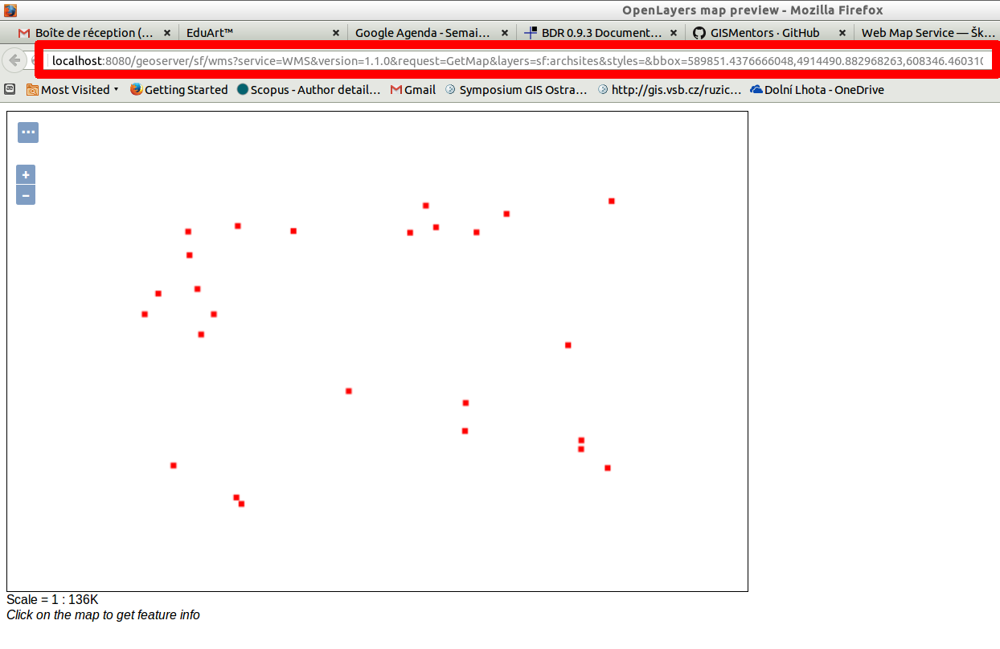
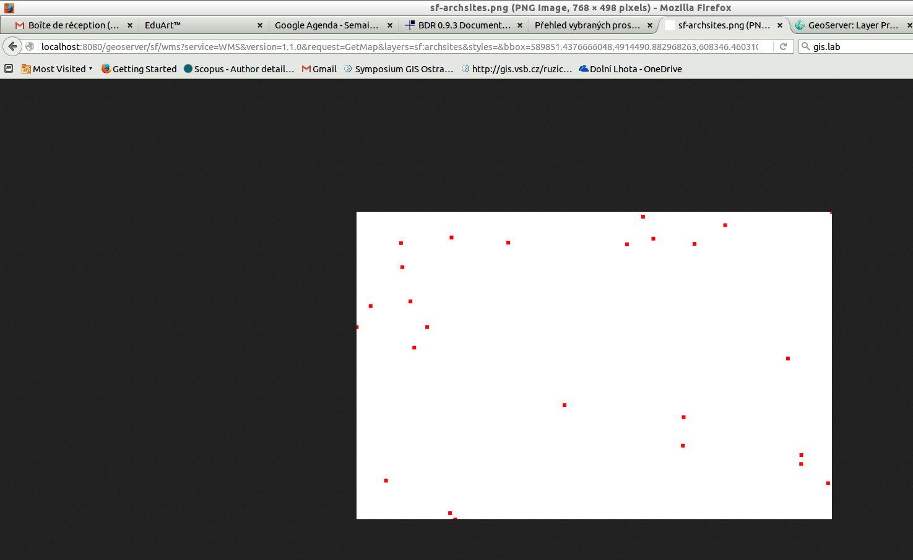
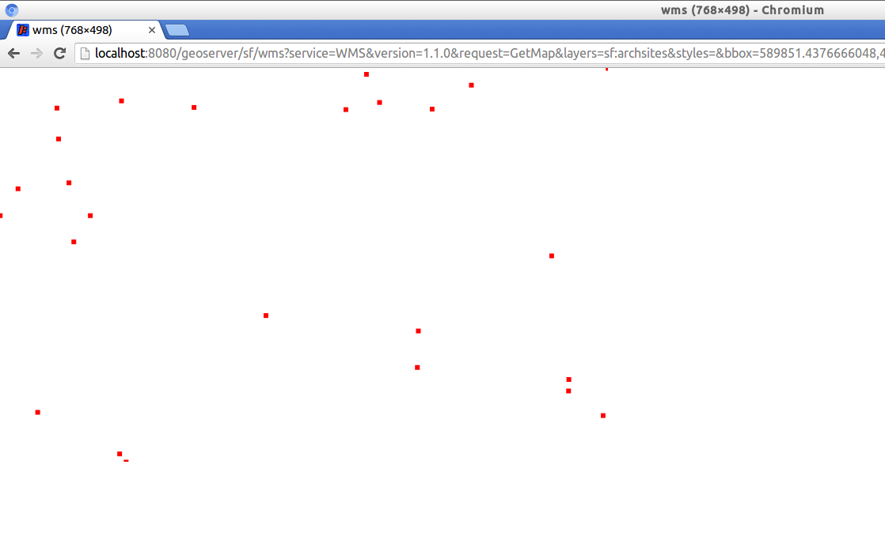
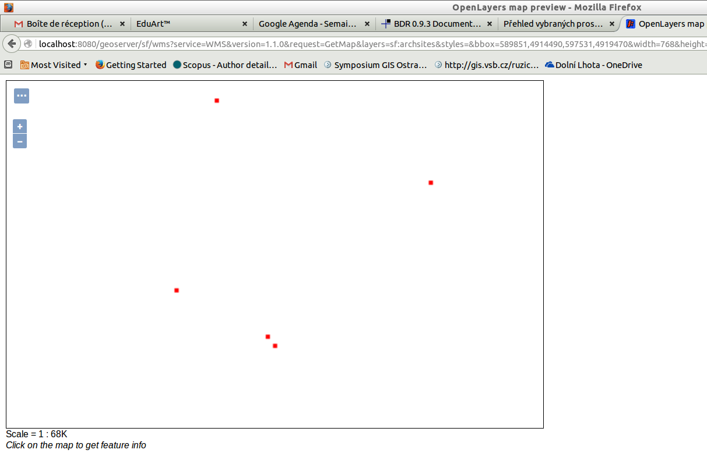
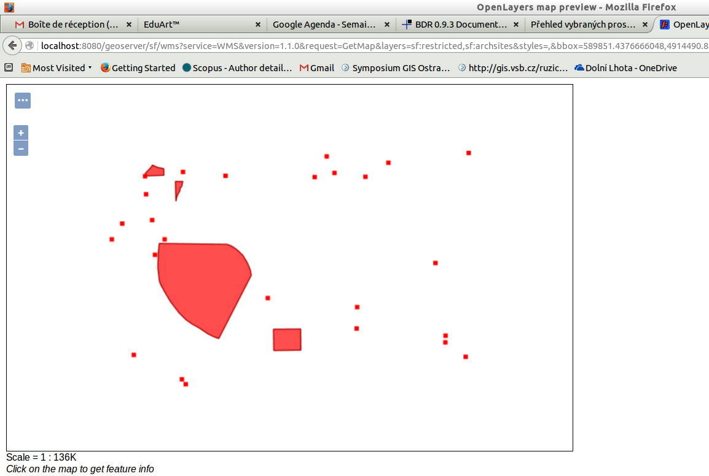

.. index::
   single: Web Map Service

.. _wms:

Web Map Service
---------------

Základní protokol, který GeoServer podporuje je
Web Map Service (WMS). WMS umožňuje klientovi ze
serveru získat geodata v podobě mapy. Obvykle se jedná
o mapu v podobě rastrového obrázku, ale není to podmínkou.
Mapa může být vrácena např. ve formátu SVG (Scalable Vector Graphics).
   
Základní dotaz WMS
==================

Základní dotaz WMS jsme již na server zaslali, když jsme testovali, zda
server běží. Pokud jste již dané okno zavřeli, pak znovu přes `Layer Preview`
vyberte možnost `Open Layers` pro vrstvu `sf:archsites`. 

Kompletní dotaz zaslaný na stranu serveru najdete v řádku URL (WWW) adresy.

   Umístění WMS dotazu v prohlížeči.

Danou adresu je možné rozebrat na jednotlivé části, kde oddělovačem je ? a &

.. code-block:: sql

	http://localhost:8080/geoserver/sf/wms?
	service=WMS&
	version=1.1.0&
	request=GetMap&
	layers=sf:archsites&
	styles=&
	bbox=589851.4376666048,4914490.882968263,608346.4603107043,4926501.8980334345&
	width=768&
	height=498&
	srs=EPSG:26713&
	format=application/openlayers

První část před otazníkem je virtuální soubor, kam je dotaz zasílán. Dispečer
serveru zašle požadavek na příslušný servlet. 

Další části jsou parametry, které určují jak bude mapa vypadat.

Service
^^^^^^^
Parametr udává název služby (protokolu), která má být využita.

Version
^^^^^^^
Parametr udává verzi služby (protokolu), která má být využita.

Request
^^^^^^^
Typ požadavku, který má být obsloužen. V případě WMS jsou možné hodnoty 
`GetCapabilities`, `GetMap` a `GetFeatureInfo`.

Layers
^^^^^^
Seznam vrstev, které mají být do mapy vykresleny. Oddělují se čárkou.

Styles
^^^^^^
Seznam stylů, které mají být použity pro vykreslení vrstev. Oddělují se čárkou.  
Pokud není nic uvedeno, použije se implicitní styl.

BBOX
^^^^
Seznam souřadnic udávající ohraničující obdélník pro výběr dat k vykreslení. 

Width
^^^^^
Šířka mapy v pixelech.

Height
^^^^^^
Výška mapy v pixelech. 

SRS nebo CRS
^^^^^^^^^^^^
Souřadnicový systém pro BBOX. Pro vezi 1.3.0 se označuje tento paramatr CRS.
K identifikaci systému se využívá kódů z databází. Hlavní databáze je `EPSG`.

Format
^^^^^^
Formát výstupního souboru.

Úkoly
=====

Pracujte pouze s URL adresou a ručně změňte následující parametry.

Format
^^^^^^
Změňte výstupní formát, tak aby se nejednalo o aplikaci `Open Layers`, ale o formát `image/png`.

BBOX
^^^^
Změňte `BBOX`, tak aby zobrazoval pouze výřez mapy.

Layers
^^^^^^
Přidejte do seznamu vrstev vrstvu `sf:restricted`, tak aby se vykreslila pod vrstvou sf:archsites.  

Řešení úkolů
============

Format
^^^^^^

.. code-block:: sql
	
	http://localhost:8080/geoserver/sf/wms?
	service=WMS&
	version=1.1.0&
	request=GetMap&
	layers=sf:archsites&
	styles=&
	bbox=589851.4376666048,4914490.882968263,608346.4603107043,4926501.8980334345&
	width=768&
	height=498&
	srs=EPSG:26713&
	format=image/png

   Parametr `FORMAT` změněn na `image/png`.
   
.. note:: Obrázek může v jiném prohlížeči vypadat jinak. Např. tak jako v chromium-browser.

   Parametr `FORMAT` změněn na `image/png` (chromium).

BBOX
^^^^
.. code-block:: sql
	
	http://localhost:8080/geoserver/sf/wms?
	service=WMS&
	version=1.1.0&
	request=GetMap&
	layers=sf:archsites&
	styles=&
	bbox=589851,4914490,597531,4919470&
	width=768&
	height=498&
	srs=EPSG:26713&
	format=application/openlayers

   Parametr `BBOX` změněn na výřez mapy.

Layers
^^^^^^

.. code-block:: sql

	http://localhost:8080/geoserver/sf/wms?
	service=WMS&
	version=1.1.0&
	request=GetMap&
	layers=sf:restricted,sf:archsites&
	styles=,&
	bbox=589851.4376666048,4914490.882968263,608346.4603107043,4926501.8980334345&
	width=768&
	height=498&
	srs=EPSG:26713&
	format=application/openlayers 

   Do parametru `LAYERS` přidána další vrstva.