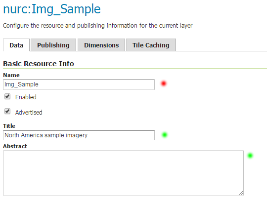
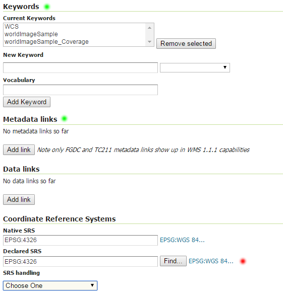
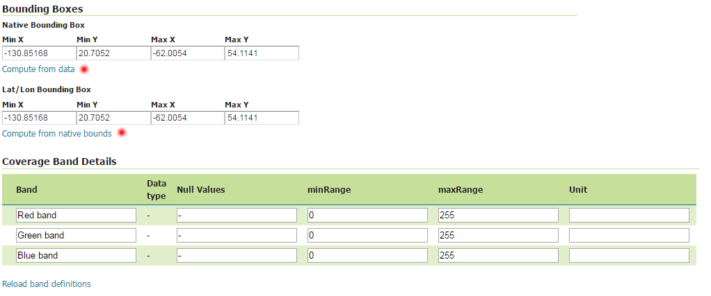

.. index::
   single: Definice rastru

.. _definicer:

Definice rastru
---------------

Rastrová vrstva se definuje pomocí popisu dat. Seznam vrstev získáme pomocí
odkazu `Layers` v sekci `Data`. V seznamu vrstev vidíme u každé vrstvy její typ, 
úložiště a souřadnicový systém. Pokud následně zvolíme vrstvu `Img_Sample`
dostáváme se ke konfiguraci rastrové vrstvy.

Identifikace
============

V rámci identifikace je povinné zadat pouze název vrstvy. Vhodné je ale uvést i popis vrstvy
a abstrakt vrstvy. Název vrstvy (name) je technickou identifikací vrstvy. Popis (`title`) a `abstrakt` je
určen ke čtení lidskému uživateli služby.

.. note:: Povinné položky jsou označeny červeným kolečkem. Položky, které je vhodné doplnit jsou označeny zeleným kolečkem.

   Identifikace rastrové vrstvy.
   
Další metadata a souřadnicové systémy
=====================================
   
V další části popisu vrstvy je vhodné uvést klíčová slova, popisující data
a pokud je to možné, pak link na metadata dle normy ISO nebo FGDC.

Povinně je nutné uvést deklarovaný souřadnicový systém (`Declared SRS`).
Tento se specifikuje s využitím databáze `EPSG`. Např. systém WGS84 má kód `EPSG:4326`.

   Další metadata a souřadnicové systémy.
   
Ohraničující obdélník
=====================
   
V další části popisu vrstvy je nutné uvést ohraničující obdélník (`BBOX`) vrstvy.
BBOX musí být uveden jak v deklarovaném `SRS` tak v `Lat/Lon` souřadnicích.
K vytvoření pomohou odkazy `Compute from data` a `Compute from native bounds`.

   BBOX

