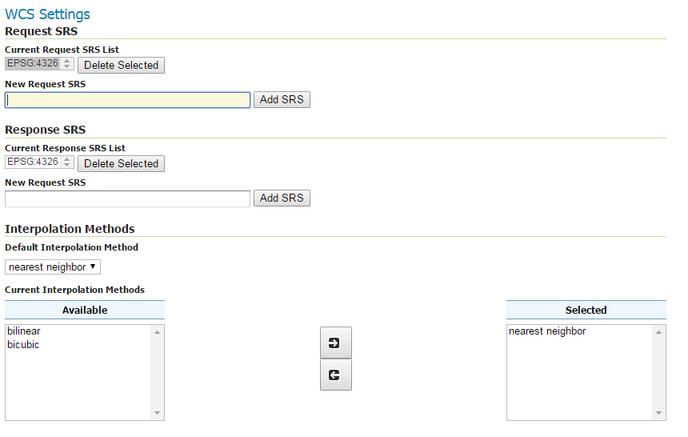
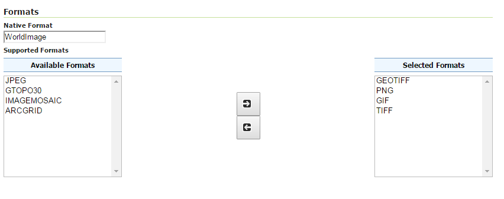

.. index::
   single: Publikování rastru

.. _publikovanir:

Publikování rastru
------------------

V rámci publikování vektorových dat můžete ještě na dalších kartách nastavovat
jakým způsobem budou data prezentována.

Publishing
==========

Karta `Publishing` nabízí nastavení implicitního stylu a seznamu doporučovaných
alternativních stylů. 

Dále je zde možné definovat parametry pro službu `WCS (Web Coverage Service)`.
V první části např. podporované souřadnicové systémy a metodu převzorkování rastru.

   Nastavení WCS - souřadnicové systémy a metoda převzorkování.

V druhé části pak formáty, ve kterých bude možné vrstvu získat.

   Nastavení WCS - formáty.

