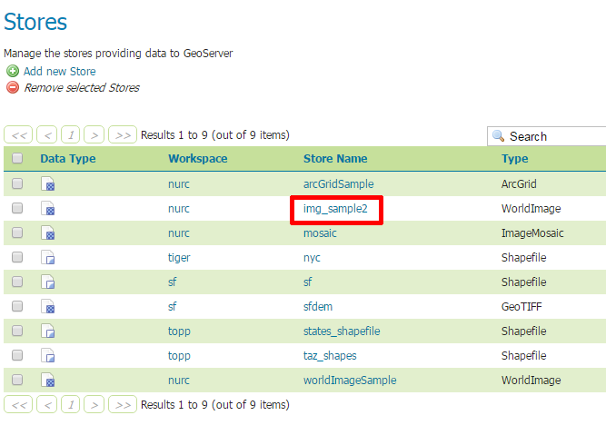
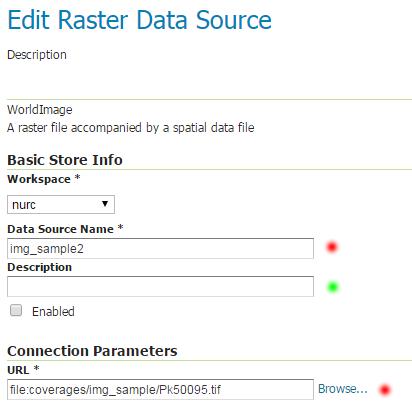

.. index::
   single: Úložiště rastru

.. _ulozister:

Úložiště rastru
---------------

Úložiště WorldImage
===================

Často využívaným úložištěm je rastrový soubor s doplňkovým souborem typu `WorldFile`. 
Např. pro `TIFF` se jedná o soubor `TFW`. Seznam existujících úložišť je možné získat pomocí odkazu 
`Stores` v sekci `Data`. 

   Seznam úložišť.
   
Pokud pak následně zvolíme prostor (např. `img_sample2`) uvidíme jeho konfiguraci. 
V rámci této konfigurace je kromně názvu poviná položka URL.
Zde je uvedena cesta k rastrovému souboru. Cesta může být relativní nebo absolutní. 
Relativní cesta začíná v adresáři `data_dir`.

.. note:: Povinné položky jsou označeny červeným kolečkem. Položky, které je vhodné doplnit jsou označeny zeleným kolečkem.

   Úložiště img_sample2.
   
.. note:: Začátečníkům se doporučuje používat pouze relativní cesty, zapsané pomocí funkce dostupné pod tlačítkem `Browse`.

