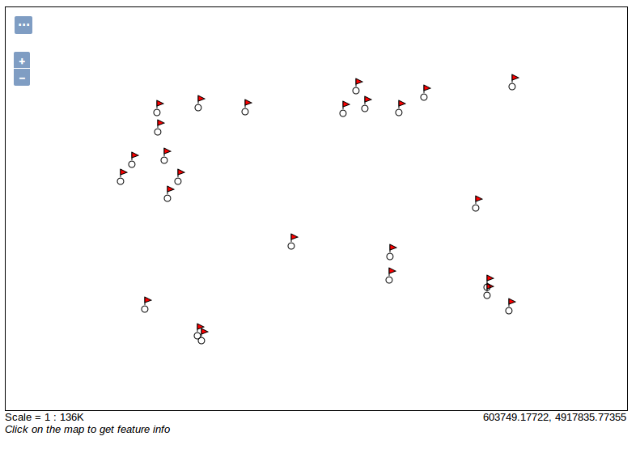

.. index::
   single: Externí grafika

.. _externi:

Externí grafika
---------------

Obvykle si se základními `Well Known` jmény nevystačíme. Pak je možné využívat obrázky
jakožto externí zdroje grafiky.

Jednoduchá externí grafika
==========================

Příkladem jednoduché externí grafiky je styl burg. Na ukázku tohto stylu se můžete podívat, tak
že ve WMS dotazu na vrstvu sf:archsites zadáte hodnotu parametru `STYLE` jako `burg`. 
Výsledek pak vypadá jako na následující ukázce.

.. code-block:: sql

   http://158.196.143.122:8080/geoserver/sf/wms?
   service=WMS&
   version=1.1.0&
   request=GetMap&
   layers=sf:archsites&
   styles=burg&
   bbox=589851.4376666048,4914490.882968263,608346.4603107043,4926501.8980334345&
   width=768&
   height=498&
   srs=EPSG:26713&
   format=application/openlayers
   

   Styl burg
   
.. code-block:: xml

   <?xml version="1.0" encoding="ISO-8859-1"?>
   <StyledLayerDescriptor version="1.0.0" 
   xmlns="http://www.opengis.net/sld" 
   xmlns:ogc="http://www.opengis.net/ogc"
   xmlns:xlink="http://www.w3.org/1999/xlink" 
   xmlns:xsi="http://www.w3.org/2001/XMLSchema-instance"
   xsi:schemaLocation="http://www.opengis.net/sld 
   http://schemas.opengis.net/sld/1.0.0/StyledLayerDescriptor.xsd">
  <NamedLayer>
    <Name>redflag</Name>
    <UserStyle>
      <Name>burg</Name>
      <Title>A small red flag</Title>
      <Abstract>A sample of how to use an SVG based symbolizer</Abstract>

      <FeatureTypeStyle>
        <Rule>
          <Title>Red flag</Title>
          <PointSymbolizer>
            <Graphic>
              <ExternalGraphic>
                <OnlineResource xlink:type="simple" xlink:href="burg02.svg" />
                <Format>image/svg+xml</Format>
              </ExternalGraphic>
              <Size>
                <ogc:Literal>20</ogc:Literal>
              </Size>
            </Graphic>
          </PointSymbolizer>
        </Rule>

      </FeatureTypeStyle>
    </UserStyle>
  </NamedLayer>
  </StyledLayerDescriptor> 

Místo značky `Mark` je použita značka `ExternalGraphic`, kde je ve značce `OnlineResource` uvedena cesta k souboru
s obrázkem. Ve značce `Format` je pak uveden formát obrázku (vhodný je SVG nebo PNG).

Úkoly
=====

Vytvořte vlastní ikonu buď ve formátu SVG nebo PNG a změňte styl `burg`, tak aby se odkazoval na tento obrázek.

.. note:: Nový obrázek musíte nakopírovat do adresáře data_dir/styles.

Řešení úkolů
============

Nová ikona
^^^^^^^^^^

.. code-block:: xml

   <?xml version="1.0" encoding="ISO-8859-1"?>
   <StyledLayerDescriptor version="1.0.0" 
   xmlns="http://www.opengis.net/sld" 
   xmlns:ogc="http://www.opengis.net/ogc"
   xmlns:xlink="http://www.w3.org/1999/xlink" 
   xmlns:xsi="http://www.w3.org/2001/XMLSchema-instance"
   xsi:schemaLocation="http://www.opengis.net/sld 
   http://schemas.opengis.net/sld/1.0.0/StyledLayerDescriptor.xsd">
  <NamedLayer>
    <Name>redflag</Name>
    <UserStyle>
      <Name>burg</Name>
      <Title>A small red flag</Title>
      <Abstract>A sample of how to use an SVG based symbolizer</Abstract>

      <FeatureTypeStyle>
        <Rule>
          <Title>Red flag</Title>
          <PointSymbolizer>
            <Graphic>
              <ExternalGraphic>
                <OnlineResource xlink:type="simple" xlink:href="hrad.svg" />
                <Format>image/svg+xml</Format>
              </ExternalGraphic>
              <Size>
                <ogc:Literal>30</ogc:Literal>
              </Size>
            </Graphic>
          </PointSymbolizer>
        </Rule>

      </FeatureTypeStyle>
    </UserStyle>
  </NamedLayer>
  </StyledLayerDescriptor> 

   Ikona hrad

.. figure:: images/hrad.svg

   Ikona hrad ve formátu SVG.  