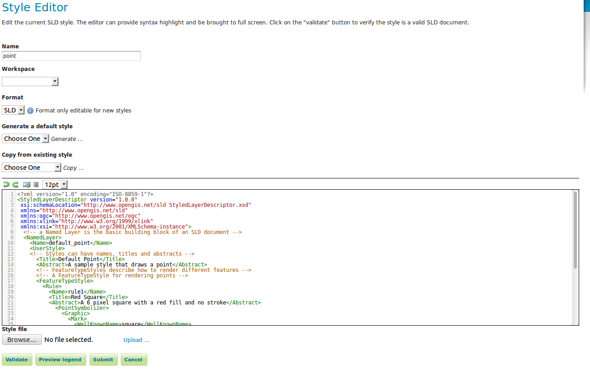
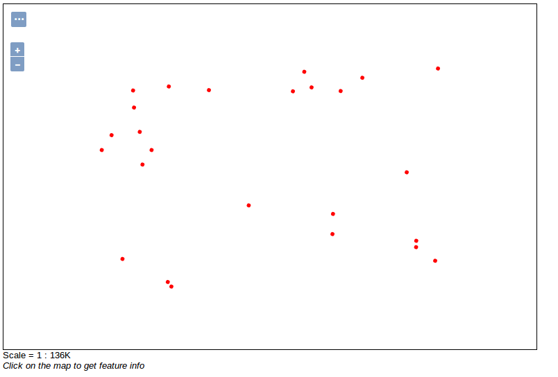
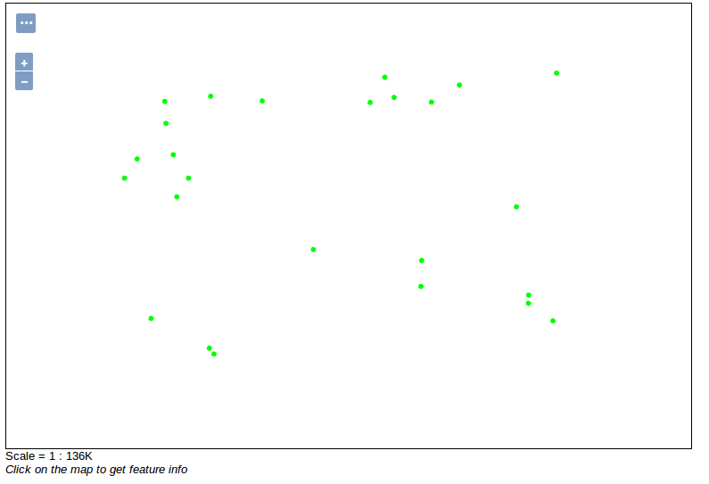

.. index::
   single: Jednoduchý styl

.. _jednoduchy:

Jednoduchý styl
----------------

Styly jsou psány v jazyce `Styled Layer Descriptor`. Jde o jazyk využívající 
syntaxi jazyka XML. 

Editace je možná v jakémkoli textovém editoru. Editace je možná i v integrovaném 
www editoru přímo v administraci nástroje GeoServer.

Styly je možné také vytvářet v nástrojích jako je AtlasStyler, QGIS, OpenJUMP nebo uDIG.

Základní styl
=============

Velmi jednoduchý styl je styl použitý pro vrstvu `sf:archsites`. Jedná se o styl `point`.
Styl si zobrazíme pomocí sekce `Data`, volba `Styles` a vybereme styl `point`.

   Styl point
   
Style je možné přímo editovat

   Editace stylu
   
.. code-block:: xml

   <?xml version="1.0" encoding="ISO-8859-1"?>
   <StyledLayerDescriptor version="1.0.0" 
    xsi:schemaLocation="http://www.opengis.net/sld StyledLayerDescriptor.xsd" 
    xmlns="http://www.opengis.net/sld" 
    xmlns:ogc="http://www.opengis.net/ogc" 
    xmlns:xlink="http://www.w3.org/1999/xlink" 
    xmlns:xsi="http://www.w3.org/2001/XMLSchema-instance">
     <!-- a Named Layer is the basic building block of an SLD document -->
     <NamedLayer>
       <Name>default_point</Name>
       <UserStyle>
       <!-- Styles can have names, titles and abstracts -->
         <Title>Default Point</Title>
         <Abstract>A sample style that draws a point</Abstract>
         <!-- FeatureTypeStyles describe how to render different features -->
         <!-- A FeatureTypeStyle for rendering points -->
         <FeatureTypeStyle>
           <Rule>
             <Name>rule1</Name>
             <Title>Red Square</Title>
             <Abstract>A 6 pixel square with a red fill and no stroke</Abstract>
               <PointSymbolizer>
                 <Graphic>
                   <Mark>
                     <WellKnownName>square</WellKnownName>
                        <Fill>
                       <CssParameter name="fill">#FF0000</CssParameter>
                     </Fill>
                   </Mark>
                 <Size>6</Size>
               </Graphic>
             </PointSymbolizer>
           </Rule>
         </FeatureTypeStyle>
       </UserStyle>
     </NamedLayer>
   </StyledLayerDescriptor>

Rule
^^^^
Hlavní částí stylu jsou pravidla (`Rule`). V naší ukázce je pouze jedno pravidlo.
Pravidla jsou pojmenována a obsahují informaci jak se má skupina objektů vykreslit.
V našem případě se daným pravidlem vykreslí všechny objekty.

PointSymbolizer
^^^^^^^^^^^^^^^
`PointSymbolizer` slouží k vykreslení bodů. V rámci definice je pak definována grafika (`Graphic`),
která bude použita.

Mark
^^^^
V našem případě jde o grafiku definovanou pomocí `WellKnownName` a `Fill`. `WellKnownName` udává symbol 
a `Fill` barvu výplně symbolu.

Úkoly
=====

Editujte styl v rámci WWW editoru. Změňte následující parametry. Styl uložte a zkuste
přes `Layer Preview` obnovit mapu.

.. note:: Pokud se nic nezměnilo, pak zkuste změnit výřez mapy. Někdy je starý obrázek v paměti prohlížeče.

WellKnownName
^^^^^^^^^^^^^
`Square` změňte na `circle`.

Fill
^^^^
Barvy výplně změňte z #FF0000 (červená) na #00FF00 (zelená).

Řešení úkolů
============

WellKnownName
^^^^^^^^^^^^^

.. code-block:: xml

   <?xml version="1.0" encoding="ISO-8859-1"?>
   <StyledLayerDescriptor version="1.0.0" 
    xsi:schemaLocation="http://www.opengis.net/sld StyledLayerDescriptor.xsd" 
    xmlns="http://www.opengis.net/sld" 
    xmlns:ogc="http://www.opengis.net/ogc" 
    xmlns:xlink="http://www.w3.org/1999/xlink" 
    xmlns:xsi="http://www.w3.org/2001/XMLSchema-instance">
     <!-- a Named Layer is the basic building block of an SLD document -->
     <NamedLayer>
       <Name>default_point</Name>
       <UserStyle>
       <!-- Styles can have names, titles and abstracts -->
         <Title>Default Point</Title>
         <Abstract>A sample style that draws a point</Abstract>
         <!-- FeatureTypeStyles describe how to render different features -->
         <!-- A FeatureTypeStyle for rendering points -->
         <FeatureTypeStyle>
           <Rule>
           <Name>rule1</Name>
             <Title>Red Circle</Title>
             <Abstract>A 6 pixel circle with a red fill and no stroke</Abstract>
               <PointSymbolizer>
                 <Graphic>
                   <Mark>
                     <WellKnownName>circle</WellKnownName>
                     <Fill>
                       <CssParameter name="fill">#FF0000</CssParameter>
                     </Fill>
                   </Mark>
                 <Size>6</Size>
               </Graphic>
             </PointSymbolizer>
           </Rule>
         </FeatureTypeStyle>
       </UserStyle>
     </NamedLayer>
   </StyledLayerDescriptor>

   Styl circle

Fill
^^^^
.. code-block:: xml

   <?xml version="1.0" encoding="ISO-8859-1"?>
   <StyledLayerDescriptor version="1.0.0" 
    xsi:schemaLocation="http://www.opengis.net/sld StyledLayerDescriptor.xsd" 
    xmlns="http://www.opengis.net/sld" 
    xmlns:ogc="http://www.opengis.net/ogc" 
    xmlns:xlink="http://www.w3.org/1999/xlink" 
    xmlns:xsi="http://www.w3.org/2001/XMLSchema-instance">
     <!-- a Named Layer is the basic building block of an SLD document -->
     <NamedLayer>
       <Name>default_point</Name>
       <UserStyle>
       <!-- Styles can have names, titles and abstracts -->
         <Title>Default Point</Title>
         <Abstract>A sample style that draws a point</Abstract>
         <!-- FeatureTypeStyles describe how to render different features -->
         <!-- A FeatureTypeStyle for rendering points -->
         <FeatureTypeStyle>
           <Rule>
           <Name>rule1</Name>
             <Title>Green Circle</Title>
             <Abstract>A 6 pixel circle with a green fill and no stroke</Abstract>
               <PointSymbolizer>
                 <Graphic>
                   <Mark>
                     <WellKnownName>circle</WellKnownName>
                     <Fill>
                       <CssParameter name="fill">#00FF00</CssParameter>
                     </Fill>
                   </Mark>
                 <Size>6</Size>
               </Graphic>
             </PointSymbolizer>
           </Rule>
         </FeatureTypeStyle>
       </UserStyle>
     </NamedLayer>
   </StyledLayerDescriptor>

   Styl green circle

