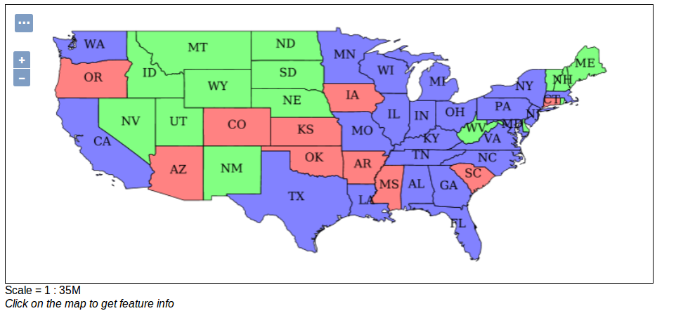
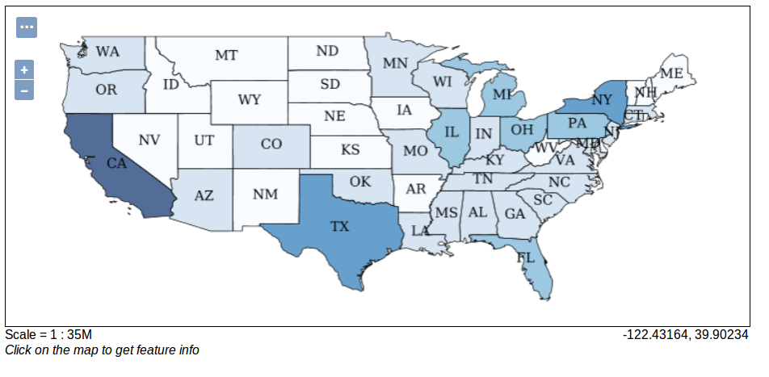
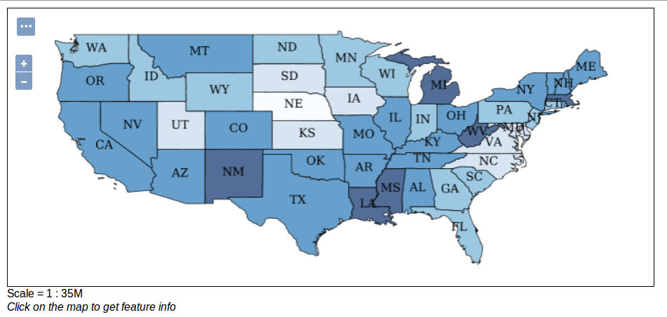

.. index::
   single: Kartogram

.. _kartogram:

Kartogram
---------

Jednodcuhý pseudokartogram je možné vytvořit pomocí filtrace dat a přiřazením stylu 
takto filtrovaným datům. V principu se vytvoří několik pravidel, pro každý filtr jedno.

Jednoduchý pseudokartogram
==========================

Příkladem jednoduchého pseudokartogramu je styl `population`. Na ukázku tohto stylu se můžete 
podívat, tak že si v náhledu vrstev vyberete vrstu `USA population` (`topp:states`). 
Výsledek pak vypadá jako na následující ukázce.
 

   Styl population
   
.. code-block:: xml

   <?xml version="1.0" encoding="ISO-8859-1"?>
    <StyledLayerDescriptor version="1.0.0" 
  xmlns="http://www.opengis.net/sld" xmlns:ogc="http://www.opengis.net/ogc"
  xmlns:xlink="http://www.w3.org/1999/xlink" 
  xmlns:xsi="http://www.w3.org/2001/XMLSchema-instance" xmlns:gml="http://www.opengis.net/gml"
  xsi:schemaLocation="http://www.opengis.net/sld 
  http://schemas.opengis.net/sld/1.0.0/StyledLayerDescriptor.xsd">
  <NamedLayer>
    <Name>USA states population</Name>
    <UserStyle>
      <Name>population</Name>
      <Title>Population in the United States</Title>
      <Abstract>A sample filter that filters the United States into three
        categories of population, drawn in different colors</Abstract>
      <FeatureTypeStyle>
        <Rule>
          <Title>&lt; 2M</Title>
          <ogc:Filter>
            <ogc:PropertyIsLessThan>
             <ogc:PropertyName>PERSONS</ogc:PropertyName>
             <ogc:Literal>2000000</ogc:Literal>
            </ogc:PropertyIsLessThan>
          </ogc:Filter>
          <PolygonSymbolizer>
             <Fill>
                <!-- CssParameters allowed are fill (the color) and fill-opacity -->
                <CssParameter name="fill">#4DFF4D</CssParameter>
                <CssParameter name="fill-opacity">0.7</CssParameter>
             </Fill>     
          </PolygonSymbolizer>
        </Rule>
        <Rule>
          <Title>2M - 4M</Title>
          <ogc:Filter>
            <ogc:PropertyIsBetween>
              <ogc:PropertyName>PERSONS</ogc:PropertyName>
              <ogc:LowerBoundary>
                <ogc:Literal>2000000</ogc:Literal>
              </ogc:LowerBoundary>
              <ogc:UpperBoundary>
                <ogc:Literal>4000000</ogc:Literal>
              </ogc:UpperBoundary>
            </ogc:PropertyIsBetween>
          </ogc:Filter>
          <PolygonSymbolizer>
             <Fill>
                <!-- CssParameters allowed are fill (the color) and fill-opacity -->
                <CssParameter name="fill">#FF4D4D</CssParameter>
                <CssParameter name="fill-opacity">0.7</CssParameter>
             </Fill>     
          </PolygonSymbolizer>
        </Rule>
        <Rule>
          <Title>&gt; 4M</Title>
          <!-- like a linesymbolizer but with a fill too -->
          <ogc:Filter>
            <ogc:PropertyIsGreaterThan>
             <ogc:PropertyName>PERSONS</ogc:PropertyName>
             <ogc:Literal>4000000</ogc:Literal>
            </ogc:PropertyIsGreaterThan>
          </ogc:Filter>
          <PolygonSymbolizer>
             <Fill>
                <!-- CssParameters allowed are fill (the color) and fill-opacity -->
                <CssParameter name="fill">#4D4DFF</CssParameter>
                <CssParameter name="fill-opacity">0.7</CssParameter>
             </Fill>     
          </PolygonSymbolizer>
        </Rule>
        <Rule>
          <Title>Boundary</Title>
          <LineSymbolizer>
            <Stroke>
              <CssParameter name="stroke-width">0.2</CssParameter>
            </Stroke>
          </LineSymbolizer>
          <TextSymbolizer>
            <Label>
              <ogc:PropertyName>STATE_ABBR</ogc:PropertyName>
            </Label>
            
              <CssParameter name="font-family">Times New Roman</CssParameter>
              <CssParameter name="font-style">Normal</CssParameter>
              <CssParameter name="font-size">14</CssParameter>
            
            <LabelPlacement>
              <PointPlacement>
                <AnchorPoint>
                  <AnchorPointX>0.5</AnchorPointX>
                  <AnchorPointY>0.5</AnchorPointY>
                </AnchorPoint>
              </PointPlacement>
            </LabelPlacement>
          </TextSymbolizer>
        </Rule>
     </FeatureTypeStyle>
    </UserStyle>
    </NamedLayer>
    </StyledLayerDescriptor>

Filtrace se realizuje pomocí nástroje `ogc:Filter`. Tento nástroj je poměrně bohatý. V našem případě 
se filtrují data na základě atributu `PERSONS` (počet obyvatel) pomocí značky `ogc:PropertyName`.
Porovnání se realizuje definicí operátoru např. pro první pravidlo je použit operátor 
`ogc:PropertyIsLessThan` (menší než) a zadání hodnoty pro porovnání `ogc:Literal`.

Úkoly
=====

Editujte styl v rámci WWW editoru. Změňte následující parametry. Styl uložte a zkuste
přes Layer Preview obnovit mapu.

Nezaměstnaní
^^^^^^^^^^^^
Upravte styl population tak aby rozdělil státy USA do pěti kategorií podle počtu nezaměstnaných (`UNEMPLOY`).

Procento nezaměstnaných na počet obyvatel
^^^^^^^^^^^^^^^^^^^^^^^^^^^^^^^^^^^^^^^^^
Upravte styl population tak aby rozdělil státy USA do pěti kategorií podle procenta nezaměstnaných (`UNEMPLOY`)
na celkový počet obyvatel (`PERSONS`).  

Řešení úkolů
============

Nezaměstnaní
^^^^^^^^^^^^

.. code-block:: xml

   <?xml version="1.0" encoding="ISO-8859-1"?>
  <StyledLayerDescriptor version="1.0.0" 
  xmlns="http://www.opengis.net/sld" xmlns:ogc="http://www.opengis.net/ogc"
  xmlns:xlink="http://www.w3.org/1999/xlink" 
  xmlns:xsi="http://www.w3.org/2001/XMLSchema-instance" xmlns:gml="http://www.opengis.net/gml"
  xsi:schemaLocation="http://www.opengis.net/sld 
  http://schemas.opengis.net/sld/1.0.0/StyledLayerDescriptor.xsd">
  <NamedLayer>
    <Name>USA states unemployed</Name>
    <UserStyle>
      <Name>unemployed</Name>
      <Title>Unemployed in the United States</Title>
      <Abstract>A sample filter that filters the United States into five
        categories of unemployed, drawn in different colors</Abstract>
      <FeatureTypeStyle>
        <Rule>
          <Title>13100 - 72079</Title>
          <ogc:Filter>
          	<ogc:And>
              <ogc:PropertyIsGreaterThan>
                <ogc:PropertyName>UNEMPLOY</ogc:PropertyName>
                <ogc:Literal>13100</ogc:Literal>
              </ogc:PropertyIsGreaterThan>
              <ogc:PropertyIsLessThanOrEqualTo>
                <ogc:PropertyName>UNEMPLOY</ogc:PropertyName>
                <ogc:Literal>72079</ogc:Literal>
              </ogc:PropertyIsLessThanOrEqualTo>
            </ogc:And>
          </ogc:Filter>
          <PolygonSymbolizer>
             <Fill>
                <!-- CssParameters allowed are fill (the color) and fill-opacity -->
                <CssParameter name="fill">#f7fbff</CssParameter>
                <CssParameter name="fill-opacity">0.7</CssParameter>
             </Fill>     
          </PolygonSymbolizer>
        </Rule>
        <Rule>
          <Title>72079 - 218598</Title>
          <ogc:Filter>
            <ogc:And>
              <ogc:PropertyIsGreaterThan>
                <ogc:PropertyName>UNEMPLOY</ogc:PropertyName>
                <ogc:Literal>72079</ogc:Literal>
              </ogc:PropertyIsGreaterThan>
              <ogc:PropertyIsLessThanOrEqualTo>
                <ogc:PropertyName>UNEMPLOY</ogc:PropertyName>
                <ogc:Literal>218598</ogc:Literal>
              </ogc:PropertyIsLessThanOrEqualTo>
            </ogc:And>
          </ogc:Filter>
          <PolygonSymbolizer>
             <Fill>
                <!-- CssParameters allowed are fill (the color) and fill-opacity -->
                <CssParameter name="fill">#c7dcef</CssParameter>
                <CssParameter name="fill-opacity">0.7</CssParameter>
             </Fill>     
          </PolygonSymbolizer>
        </Rule>
        
         <Rule>
          <Title>218598 - 385040</Title>
          <ogc:Filter>
            <ogc:And>
              <ogc:PropertyIsGreaterThan>
                <ogc:PropertyName>UNEMPLOY</ogc:PropertyName>
                <ogc:Literal>218598</ogc:Literal>
              </ogc:PropertyIsGreaterThan>
              <ogc:PropertyIsLessThanOrEqualTo>
                <ogc:PropertyName>UNEMPLOY</ogc:PropertyName>
                <ogc:Literal>385040</ogc:Literal>
              </ogc:PropertyIsLessThanOrEqualTo>
            </ogc:And>
          </ogc:Filter>
          <PolygonSymbolizer>
             <Fill>
                <!-- CssParameters allowed are fill (the color) and fill-opacity -->
                <CssParameter name="fill">#72b2d7</CssParameter>
                <CssParameter name="fill-opacity">0.7</CssParameter>
             </Fill>     
          </PolygonSymbolizer>
        </Rule>
        
        <Rule>
          <Title>385040 - 636280</Title>
          <ogc:Filter>
            <ogc:And>
              <ogc:PropertyIsGreaterThan>
                <ogc:PropertyName>UNEMPLOY</ogc:PropertyName>
                <ogc:Literal>385040</ogc:Literal>
              </ogc:PropertyIsGreaterThan>
              <ogc:PropertyIsLessThanOrEqualTo>
                <ogc:PropertyName>UNEMPLOY</ogc:PropertyName>
                <ogc:Literal>636280</ogc:Literal>
              </ogc:PropertyIsLessThanOrEqualTo>
            </ogc:And>
          </ogc:Filter>
          <PolygonSymbolizer>
             <Fill>
                <!-- CssParameters allowed are fill (the color) and fill-opacity -->
                <CssParameter name="fill">#2878b8</CssParameter>
                <CssParameter name="fill-opacity">0.7</CssParameter>
             </Fill>     
          </PolygonSymbolizer>
        </Rule>
        
        <Rule>
          <Title>636280 - 996502</Title>
          <ogc:Filter>
            <ogc:And>
              <ogc:PropertyIsGreaterThan>
                <ogc:PropertyName>UNEMPLOY</ogc:PropertyName>
                <ogc:Literal>636280</ogc:Literal>
              </ogc:PropertyIsGreaterThan>
              <ogc:PropertyIsLessThanOrEqualTo>
                <ogc:PropertyName>UNEMPLOY</ogc:PropertyName>
                <ogc:Literal>996502</ogc:Literal>
              </ogc:PropertyIsLessThanOrEqualTo>
            </ogc:And>
          </ogc:Filter>
          <PolygonSymbolizer>
             <Fill>
                <!-- CssParameters allowed are fill (the color) and fill-opacity -->
                <CssParameter name="fill">#08306b</CssParameter>
                <CssParameter name="fill-opacity">0.7</CssParameter>
             </Fill>     
          </PolygonSymbolizer>
        </Rule>
        
        <Rule>
          <Title>Boundary</Title>
          <LineSymbolizer>
            <Stroke>
              <CssParameter name="stroke-width">0.2</CssParameter>
            </Stroke>
          </LineSymbolizer>
          <TextSymbolizer>
            <Label>
              <ogc:PropertyName>STATE_ABBR</ogc:PropertyName>
            </Label>
            
              <CssParameter name="font-family">Times New Roman</CssParameter>
              <CssParameter name="font-style">Normal</CssParameter>
              <CssParameter name="font-size">14</CssParameter>
            
            <LabelPlacement>
              <PointPlacement>
                <AnchorPoint>
                  <AnchorPointX>0.5</AnchorPointX>
                  <AnchorPointY>0.5</AnchorPointY>
                </AnchorPoint>
              </PointPlacement>
            </LabelPlacement>
          </TextSymbolizer>
        </Rule>
     </FeatureTypeStyle>
    </UserStyle>
    </NamedLayer>
   </StyledLayerDescriptor>

   Styl unemployed
   
   
Procento nezaměstnaných na počet obyvatel
^^^^^^^^^^^^^^^^^^^^^^^^^^^^^^^^^^^^^^^^^

.. code-block:: xml

   <?xml version="1.0" encoding="ISO-8859-1"?>
  <StyledLayerDescriptor version="1.0.0" 
  xmlns="http://www.opengis.net/sld" xmlns:ogc="http://www.opengis.net/ogc"
  xmlns:xlink="http://www.w3.org/1999/xlink" 
  xmlns:xsi="http://www.w3.org/2001/XMLSchema-instance" xmlns:gml="http://www.opengis.net/gml"
  xsi:schemaLocation="http://www.opengis.net/sld 
  http://schemas.opengis.net/sld/1.0.0/StyledLayerDescriptor.xsd">
  <NamedLayer>
    <Name>USA states unemployed</Name>
    <UserStyle>
      <Name>unemployed</Name>
      <Title>Unemployed in the United States</Title>
      <Abstract>A sample filter that filters the United States into five
        categories of unemployed, drawn in different colors</Abstract>
      <FeatureTypeStyle>
        <Rule>
          <Title>1.8 - 2</Title>
          <ogc:Filter>
          	<ogc:And>
              <ogc:PropertyIsGreaterThan>
                <ogc:Mul>
                  <ogc:Div>
                    <ogc:PropertyName>UNEMPLOY</ogc:PropertyName>
                    <ogc:PropertyName>PERSONS</ogc:PropertyName>
                  </ogc:Div>
                  <ogc:Literal>100</ogc:Literal>
                </ogc:Mul>
                <ogc:Literal>1.8</ogc:Literal>
              </ogc:PropertyIsGreaterThan>
              <ogc:PropertyIsLessThanOrEqualTo>
                <ogc:Mul>
                  <ogc:Div>
                    <ogc:PropertyName>UNEMPLOY</ogc:PropertyName>
                    <ogc:PropertyName>PERSONS</ogc:PropertyName>
                  </ogc:Div>
                  <ogc:Literal>100</ogc:Literal>
                </ogc:Mul>
                <ogc:Literal>2</ogc:Literal>
              </ogc:PropertyIsLessThanOrEqualTo>
            </ogc:And>
          </ogc:Filter>
          <PolygonSymbolizer>
             <Fill>
                <!-- CssParameters allowed are fill (the color) and fill-opacity -->
                <CssParameter name="fill">#f7fbff</CssParameter>
                <CssParameter name="fill-opacity">0.7</CssParameter>
             </Fill>     
          </PolygonSymbolizer>
        </Rule>
        <Rule>
          <Title>2 - 2.5</Title>
          <ogc:Filter>
            <ogc:And>
              <ogc:PropertyIsGreaterThan>
                <ogc:Mul>
                  <ogc:Div>
                    <ogc:PropertyName>UNEMPLOY</ogc:PropertyName>
                    <ogc:PropertyName>PERSONS</ogc:PropertyName>
                  </ogc:Div>
                  <ogc:Literal>100</ogc:Literal>
                </ogc:Mul>
                <ogc:Literal>2</ogc:Literal>
              </ogc:PropertyIsGreaterThan>
              <ogc:PropertyIsLessThanOrEqualTo>
                <ogc:Mul>
                  <ogc:Div>
                    <ogc:PropertyName>UNEMPLOY</ogc:PropertyName>
                    <ogc:PropertyName>PERSONS</ogc:PropertyName>
                  </ogc:Div>
                  <ogc:Literal>100</ogc:Literal>
                </ogc:Mul>
                <ogc:Literal>2.5</ogc:Literal>
              </ogc:PropertyIsLessThanOrEqualTo>
            </ogc:And>
          </ogc:Filter>
          <PolygonSymbolizer>
             <Fill>
                <!-- CssParameters allowed are fill (the color) and fill-opacity -->
                <CssParameter name="fill">#c7dcef</CssParameter>
                <CssParameter name="fill-opacity">0.7</CssParameter>
             </Fill>     
          </PolygonSymbolizer>
        </Rule>
        
         <Rule>
          <Title>2.5 - 3</Title>
          <ogc:Filter>
            <ogc:And>
              <ogc:PropertyIsGreaterThan>
                <ogc:Mul>
                  <ogc:Div>
                    <ogc:PropertyName>UNEMPLOY</ogc:PropertyName>
                    <ogc:PropertyName>PERSONS</ogc:PropertyName>
                  </ogc:Div>
                  <ogc:Literal>100</ogc:Literal>
                </ogc:Mul>
                <ogc:Literal>2.5</ogc:Literal>
              </ogc:PropertyIsGreaterThan>
              <ogc:PropertyIsLessThanOrEqualTo>
                <ogc:Mul>
                  <ogc:Div>
                    <ogc:PropertyName>UNEMPLOY</ogc:PropertyName>
                    <ogc:PropertyName>PERSONS</ogc:PropertyName>
                  </ogc:Div>
                  <ogc:Literal>100</ogc:Literal>
                </ogc:Mul>
                <ogc:Literal>3</ogc:Literal>
              </ogc:PropertyIsLessThanOrEqualTo>
            </ogc:And>
          </ogc:Filter>
          <PolygonSymbolizer>
             <Fill>
                <!-- CssParameters allowed are fill (the color) and fill-opacity -->
                <CssParameter name="fill">#72b2d7</CssParameter>
                <CssParameter name="fill-opacity">0.7</CssParameter>
             </Fill>     
          </PolygonSymbolizer>
        </Rule>
        
        <Rule>
          <Title>3 - 3.5</Title>
          <ogc:Filter>
            <ogc:And>
              <ogc:PropertyIsGreaterThan>
                <ogc:Mul>
                  <ogc:Div>
                    <ogc:PropertyName>UNEMPLOY</ogc:PropertyName>
                    <ogc:PropertyName>PERSONS</ogc:PropertyName>
                  </ogc:Div>
                  <ogc:Literal>100</ogc:Literal>
                </ogc:Mul>
                <ogc:Literal>3</ogc:Literal>
              </ogc:PropertyIsGreaterThan>
              <ogc:PropertyIsLessThanOrEqualTo>
                <ogc:Mul>
                  <ogc:Div>
                    <ogc:PropertyName>UNEMPLOY</ogc:PropertyName>
                    <ogc:PropertyName>PERSONS</ogc:PropertyName>
                  </ogc:Div>
                  <ogc:Literal>100</ogc:Literal>
                </ogc:Mul>
                <ogc:Literal>3.5</ogc:Literal>
              </ogc:PropertyIsLessThanOrEqualTo>
            </ogc:And>
          </ogc:Filter>
          <PolygonSymbolizer>
             <Fill>
                <!-- CssParameters allowed are fill (the color) and fill-opacity -->
                <CssParameter name="fill">#2878b8</CssParameter>
                <CssParameter name="fill-opacity">0.7</CssParameter>
             </Fill>     
          </PolygonSymbolizer>
        </Rule>
        
        <Rule>
          <Title>3.5 - 4.2</Title>
          <ogc:Filter>
            <ogc:And>
              <ogc:PropertyIsGreaterThan>
                <ogc:Mul>
                  <ogc:Div>
                    <ogc:PropertyName>UNEMPLOY</ogc:PropertyName>
                    <ogc:PropertyName>PERSONS</ogc:PropertyName>
                  </ogc:Div>
                  <ogc:Literal>100</ogc:Literal>
                </ogc:Mul>
                <ogc:Literal>3.5</ogc:Literal>
              </ogc:PropertyIsGreaterThan>
              <ogc:PropertyIsLessThanOrEqualTo>
                <ogc:Mul>
                  <ogc:Div>
                    <ogc:PropertyName>UNEMPLOY</ogc:PropertyName>
                    <ogc:PropertyName>PERSONS</ogc:PropertyName>
                  </ogc:Div>
                  <ogc:Literal>100</ogc:Literal>
                </ogc:Mul>
                <ogc:Literal>4.2</ogc:Literal>
              </ogc:PropertyIsLessThanOrEqualTo>
            </ogc:And>
          </ogc:Filter>
          <PolygonSymbolizer>
             <Fill>
                <!-- CssParameters allowed are fill (the color) and fill-opacity -->
                <CssParameter name="fill">#08306b</CssParameter>
                <CssParameter name="fill-opacity">0.7</CssParameter>
             </Fill>     
          </PolygonSymbolizer>
        </Rule>
        
        <Rule>
          <Title>Boundary</Title>
          <LineSymbolizer>
            <Stroke>
              <CssParameter name="stroke-width">0.2</CssParameter>
            </Stroke>
          </LineSymbolizer>
          <TextSymbolizer>
            <Label>
              <ogc:PropertyName>STATE_ABBR</ogc:PropertyName>
            </Label>
            
              <CssParameter name="font-family">Times New Roman</CssParameter>
              <CssParameter name="font-style">Normal</CssParameter>
              <CssParameter name="font-size">14</CssParameter>
            
            <LabelPlacement>
              <PointPlacement>
                <AnchorPoint>
                  <AnchorPointX>0.5</AnchorPointX>
                  <AnchorPointY>0.5</AnchorPointY>
                </AnchorPoint>
              </PointPlacement>
            </LabelPlacement>
          </TextSymbolizer>
        </Rule>
     </FeatureTypeStyle>
    </UserStyle>
    </NamedLayer>
  </StyledLayerDescriptor>

   Styl unemployed2

