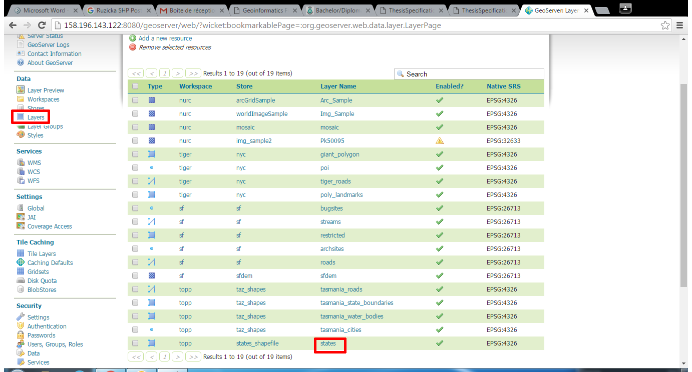
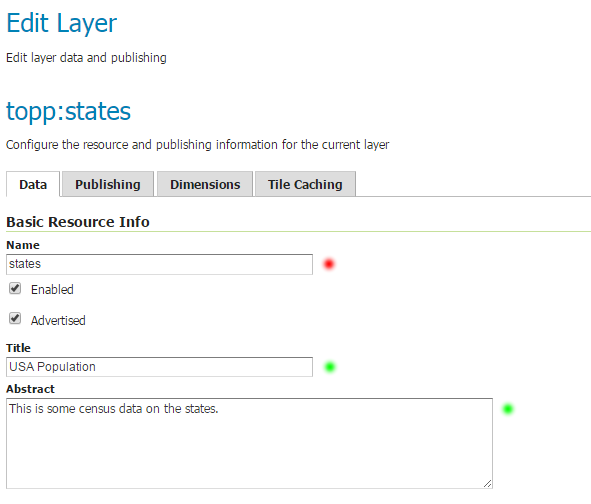
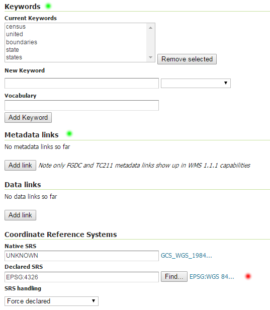
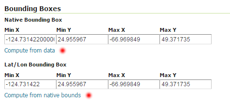
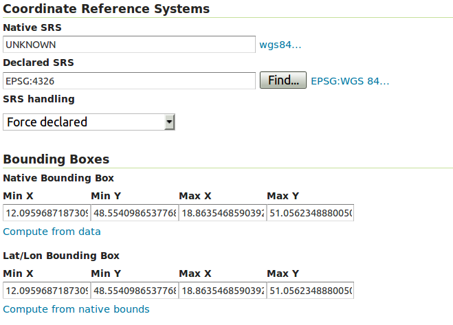
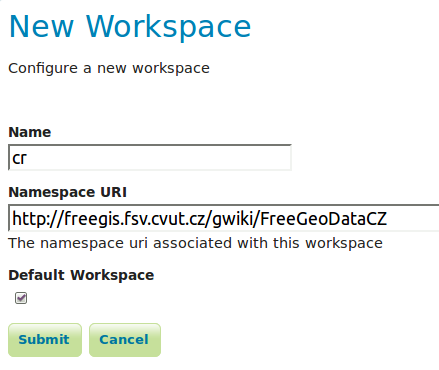
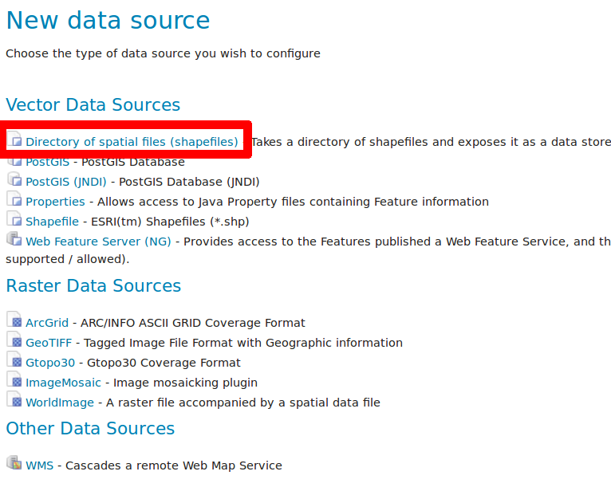
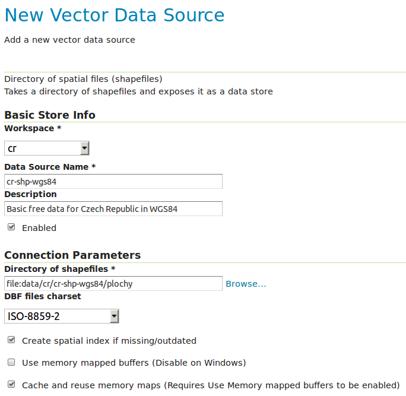
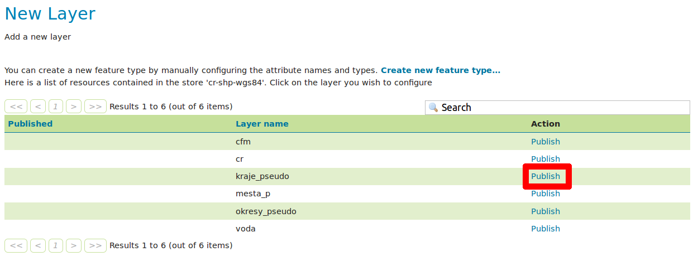

.. index::
   single: Definice vektoru

.. _definicev:

Definice vektoru
----------------

Vektorová vrstva se definuje pomocí popisu dat. Seznam vrstev získáme pomocí
odkazu `Layers` v sekci `Data`.

   Seznam vrstev.

V seznamu vrstev vidíme u každé vrstvy její typ, úložiště a souřadnicový systém.
Pokud následně zvolíme vrstvu `states` dostáváme se ke konfiguraci vektorové vrstvy.

Identifikace
============

V rámci identifikace je povinné zadat pouze název vrstvy. Vhodné je ale uvést i popis vrstvy
a abstrakt vrstvy. Název vrstvy (name) je technickou identifikací vrstvy. Popis (`title`) a `abstrakt` je
určen ke čtení lidskému uživateli služby.

.. note:: Povinné položky jsou označeny červeným kolečkem. Položky, které je vhodné doplnit jsou označeny zeleným kolečkem.

   Identifikace vektorové vrstvy.
   
Další metadata a souřadnicové systémy
=====================================
   
V další části popisu vrstvy je vhodné uvést klíčová slova, popisující data
a pokud je to možné, pak link na metadata dle normy ISO nebo FGDC.

Povinně je nutné uvést deklarovaný souřadnicový systém (`Declared SRS`).
Tento se specifikuje s využitím databáze `EPSG`. Např. systém `WGS84` má kód `EPSG:4326`.

   Další metadata a souřadnicové systémy.
   
Ohraničující obdélník
=====================
   
V další části popisu vrstvy je nutné uvést ohraničující obdélník (`BBOX`) vrstvy.
`BBOX` musí být uveden jak v `deklarovaném SRS` tak v `Lat/Lon` souřadnicích.
K vytvoření pomohou odkazy `Compute from data` a `Compute from native bounds`.

   BBOX

Úkoly
=====

Vypublikujte vrstvu kraje_pseudo ze zdroje FreeGeodataCZ<http://geo.fsv.cvut.cz/data/grasswikicz/freegeodatacz/aktualni/cr-shp-wgs84-0.3.3.zip>.
Vrstvu nakopírujte do adresáře data_dir/data/cr-shp-wgs84. 

.. note:: Tento adresář neexistuje, musíte jej vytvořit.

Pak vytvořte nový Worskspace a nový Storage.

Řešení úkolů
============

Vrstva kraje_pseudo
^^^^^^^^^^^^^^^^^^^

Pokud jste data nakopírovali správně, pak v rámci definice vrstvy musíte pouze nastavit `Declared SRS` na `EPSG:4326` a spočítat BBOX.

   Nastavení BBOX a SRS pro kraje_pseudo.
   
Předtím však musíte projít kroky vytvoření `Workspace` (nepovinné) a `Store` (povinné).

   Nový pracovní prostor cr.

.. note:: Prostor můžete zvolit jako `Default`. Vše pak od této chvíle bude realizováno v tomto prostoru.

   Typy úložišť.

   Úložiště cr-shp-wgs84.

.. note:: U úložiště můžete zvolit `kódování diakritiky`, kvůli popiskům v mapě.

   Seznam vrstev v úložišti cr-shp-wgs84.