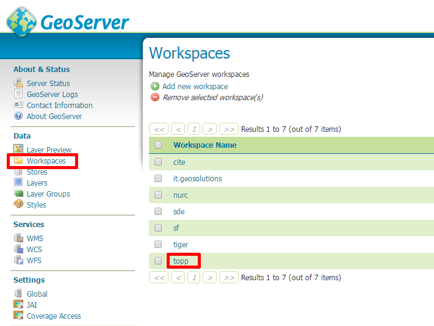
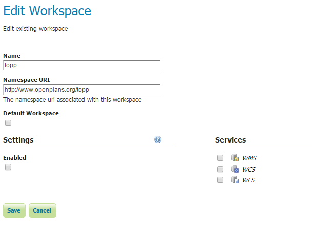
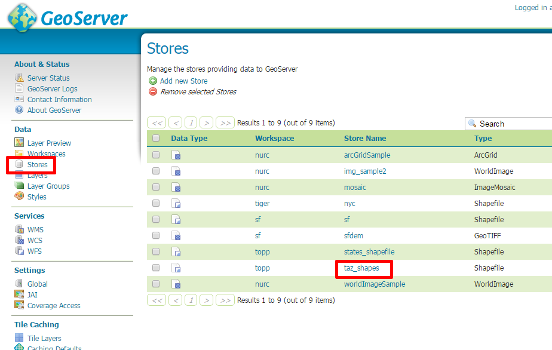
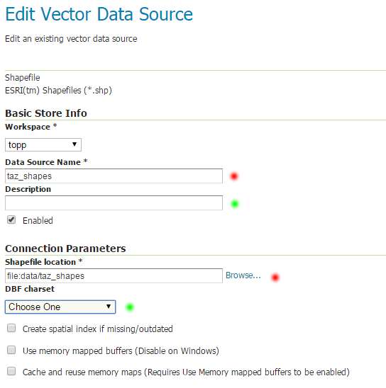

.. index::
   single: Úložiště vektoru

.. _ulozistev:

Úložiště vektoru
----------------

Úložiště (`Storage`) slouží k definici datového skladu, ze kterého budou
data publikována.

Před samotnou prací s úložišti je vhodné věnovat pozornost pracovním 
prostorům (`Workspaces`).

Workspaces
==========

Pracovní prostory slouží pro lepší organizaci v rámci serveru. Pro pracovní prostor
je možné definovat samostatná metadata, přístupová práva a další nastavení.

Seznam pracovních prostorů je možné získat pomocí odkazu `Workspaces` v sekci `Data`.

   Seznam pracovních prostorů.
   
Pokud pak následně zvolíme prostor (např. `topp`) uvidíme jeho konfiguraci. 
V rámci této konfigurace je kromně názvu důležitá položka URI. URI jednoznačně
identifikuje prostor v rámci všehomíra. Jako vhodné hodnoty jsou možné téměř 
všechny URL, přičemž daná URL nemusí reálně existovat.

   Konfigurace pracovního prostoru.
   
Úložiště ESRI Shapefile
=======================

Často využívaným úložištěm je adresář se soubory typou `ESRI Shapefile`. Seznam
existujících úložišť je možné získat pomocí odkazu `Stores` v sekci `Data`. 

   Seznam úložišť.
   
Pokud pak následně zvolíme prostor (např. `taz_shapes`) uvidíme jeho konfiguraci. 
V rámci této konfigurace je kromě názvu poviná položka `Shapefile location`.
Zde je uvedena cesta k adresáři se soubory. Cesta může být relativní nebo absolutní. 
Relativní cesta začíná v adresáři `data_dir`.

.. note:: Povinné položky jsou označeny červeným kolečkem. Položky, které je vhodné doplnit jsou označeny zeleným kolečkem.

   Úložiště taz_shapes.
   
.. note:: Začátečníkům se doporučuje používat pouze relativní cesty, zapsané pomocí funkce dostupné pod tlačítkem `Browse`.

